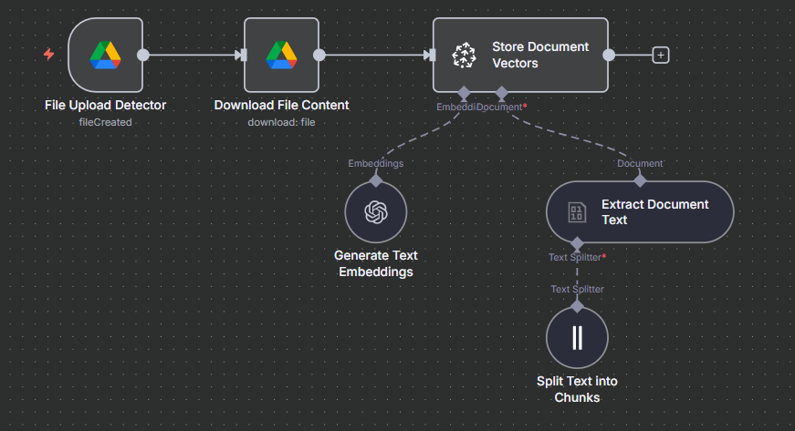
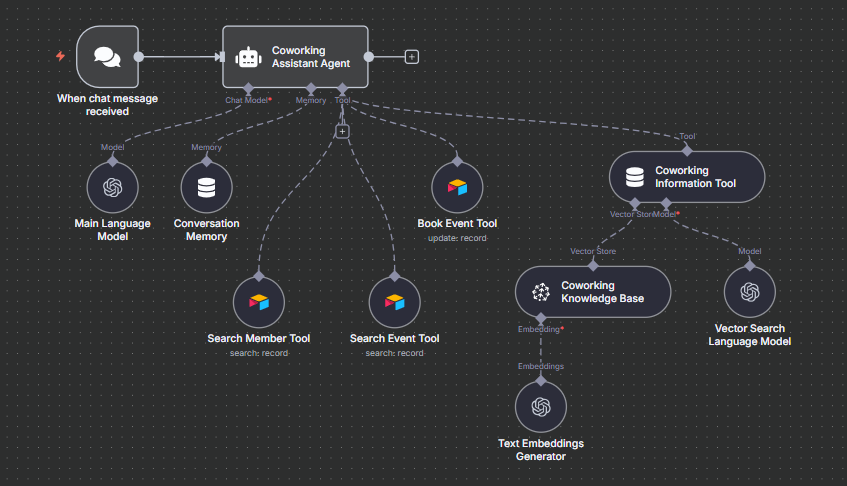

# Coworking Agent

## Overview

The Coworking Agent is an AI-powered assistant for managing coworking space events, member reservations, and document search. Built with n8n, LangChain, Pinecone, Airtable, and OpenAI, it enables non-technical users to automate event management and member operations.

## Features

- Answers frequently asked questions about the coworking space.
- Retrieves event and member details from Airtable datasets.
- Books events for members and manages reservations.
- Searches and retrieves information from uploaded documents (e.g., `NormativaCoworking.md`) using Pinecone and OpenAI.
- Maintains short-term chat context for seamless conversations.

## Workflow Structure

### Main Agent (`Coworking_Agent.json`)

- **Chat Trigger:** Listens for incoming chat messages.
- **AI Agent:** Processes queries and coordinates event/member tools.
- **Coworking Information Tool:** Answers questions about the coworking space.
- **Search Member Tool:** Finds member details by email.
- **Search Event Tool:** Finds event details by type.
- **Book Event Tool:** Books events for members.
- **Memory Buffer:** Maintains chat context.

### Document Upload (`Coworking_Upload.json`)

- **File Upload Detector:** Monitors Google Drive for new document uploads (e.g., `NormativaCoworking.md`).
- **Download File Content:** Downloads new files.
- **Generate Text Embeddings:** Creates embeddings for document search.
- **Store Document Vectors:** Indexes documents in Pinecone for semantic search.
- **Extract Document Text:** Loads document content for processing.
- **Split Text into Chunks:** Prepares documents for efficient retrieval.

## Example Datasets

### Events (Airtable)

| Event Name                 | Schedule           |
| -------------------------- | ------------------ |
| UX Design Workshop         | 10/12/2026 3:00 PM |
| AI and Business Talk       | 15/1/2025 10:30am  |
| Startup Networking         | 15/5/2025 7:00pm   |
| Digital Marketing Workshop | 23/7/2025 4:15pm   |
| Open Coworking Session     | 26/8/2025 11:00am  |

### Members (Airtable)

| Member          | Email                     | Plan    |
| --------------- | ------------------------- | ------- |
| John Perez      | john.perez@email.com      | Monthly |
| Anna Lopez      | anna.lopez@email.com      | Daily   |
| Charles Ramirez | charles.ramirez@email.com | Weekly  |
| Laura Sanchez   | laura.sanchez@email.com   | Monthly |
| Peter Gomez     | peter.gomez@email.com     | Yearly  |

### Document Example

The agent can read and answer questions about uploaded documents such as `NormativaCoworking.md` (Coworking Regulations). Make sure this file is available in the monitored Google Drive folder for document search and retrieval.

## How It Works

1. User sends a message or request.
2. Agent determines if the query is about events, members, or documents.
3. Retrieves event/member data from Airtable as needed.
4. Books events or answers questions using integrated tools.
5. Searches uploaded documents (e.g., regulations) for relevant information.
6. Responds concisely and professionally.

## Setup Instructions

1. **Connect Airtable:** Add your event and member datasets.
2. **Configure Pinecone:** Set up for document search and indexing.
3. **Connect Google Drive:** Add credentials for document uploads and ensure `NormativaCoworking.md` is present.
4. **Deploy Agent:** Activate workflows in n8n.

## Environment Variables

- `AIRTABLE_BASE_ID`, `AIRTABLE_BASE_URL`: Airtable base configuration.
- `AIRTABLE_MEMBERS_TABLE_ID`, `AIRTABLE_MEMBERS_TABLE_URL`: Members table.
- `AIRTABLE_EVENTS_TABLE_ID`, `AIRTABLE_EVENTS_TABLE_URL`: Events table.
- `GOOGLE_DRIVE_FOLDER_ID`, `GOOGLE_DRIVE_FOLDER_URL`: Google Drive folder for uploads.
- Pinecone and OpenAI credentials as configured in n8n.

## Notes

- Timezone: America/Argentina/Buenos_Aires
- No secrets are stored in workflow files; all credentials are referenced via environment variables.
- All workflows are inactive by default for safety.
- Images are referenced as covers for clarity and consistency.

## Example Query

> "What are the rules for booking a meeting room?"
>
> Agent: "According to the coworking regulations, meeting rooms must be booked at least 24 hours in advance. Please refer to NormativaCoworking.md for details."

---

For questions or support, refer to the course documentation or open an issue in the repository.
