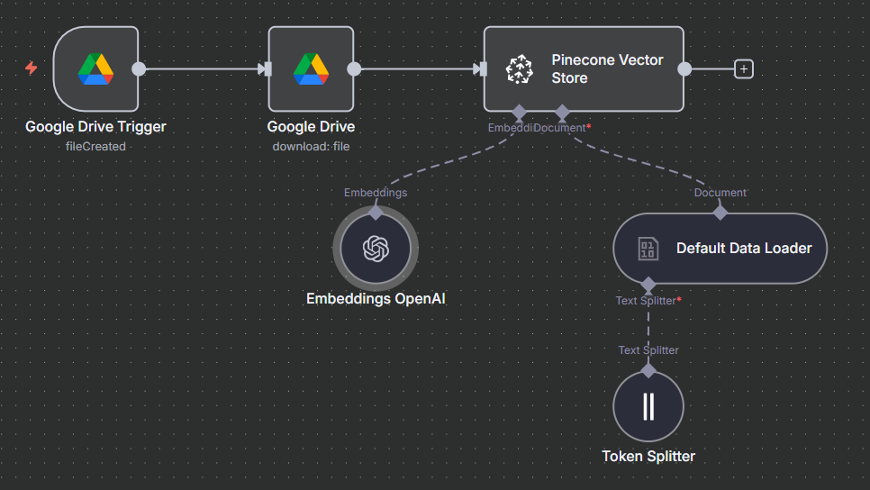

# Ecommerce Agent

## Overview

The Ecommerce Agent is an AI-powered assistant designed to answer customer queries, provide product information, and support ecommerce operations. It leverages Google Sheets for product inventory, integrates with Pinecone for document search, and uses OpenAI for natural language understanding.

## Features

- Responds to customer questions about products and ecommerce operations.
- Retrieves product details from a Google Sheets inventory.
- Answers operational and policy questions using the `Return_Policy.md` document.
- Integrates with Pinecone for fast document search and retrieval.
- Uses OpenAI for concise, clear responses (max 200 characters).
- Provides purchase links for customers ready to buy.

## Workflow Structure

### Main Agent (`Ecommerce_Agent.json`)

- **Chat Trigger:** Listens for incoming chat messages.
- **AI Agent:** Processes queries using product and document tools.
- **Product Tool:** Connects to Google Sheets for live product data.
- **Document Tool:** Uses Pinecone and OpenAI to answer operational/policy questions from `Return_Policy.md`.
- **Memory Buffer:** Maintains short-term chat context.

### Document Upload (`Ecommerce_Upload.json`)

- **Google Drive Trigger:** Monitors a folder for new document uploads.
- **Google Drive Node:** Downloads new files.
- **Embeddings & Pinecone:** Indexes documents for semantic search.
- **Text Splitter & Data Loader:** Prepares documents for efficient retrieval.

## Product Inventory (Google Sheets)

| Product ID | Name                    | Description                       | Available Quantity | Unit Price (USD) | Category       |
| ---------- | ----------------------- | --------------------------------- | ------------------ | ---------------- | -------------- |
| 1          | Bluetooth Headphones    | Wireless headphones, clear sound  | 50                 | $29.99           | Electronics    |
| 2          | Sports Backpack         | Gym backpack, 30L                 | 30                 | $45.00           | Fashion        |
| 3          | Smartwatch              | Smart watch, activity monitor     | 20                 | $120.00          | Electronics    |
| 4          | HD Webcam               | Webcam for video calls, 1080p     | 15                 | $39.99           | Electronics    |
| 5          | Ergonomic Office Chair  | Adjustable chair, armrests        | 25                 | $89.99           | Office         |
| 6          | Stainless Steel Thermos | Thermos, 500ml, keeps temperature | 100                | $18.50           | Home & Kitchen |
| 7          | Sports T-Shirt          | Cotton T-shirt, size L            | 60                 | $15.99           | Fashion        |
| 8          | LED Desk Lamp           | Dimmable lamp, 3 light modes      | 40                 | $22.99           | Home & Office  |
| 9          | Winter Boots            | Waterproof boots, size 42         | 35                 | $75.00           | Fashion        |
| 10         | Laptop Sleeve           | Protective sleeve, 15"            | 80                 | $12.99           | Accessories    |

## How It Works

1. **Customer sends a message.**
2. **Agent checks if the query is about products or operations/policies.**
3. **Product queries:** Retrieves info from Google Sheets.
4. **Operational/policy queries:** Searches the `Return_Policy.md` document.
5. **Agent responds concisely, with purchase links if needed.**

## Course Topics

- AI Agent for Ecommerce
- AI Agent Foundations
- Customer Information
- Agent Design
- Product Inventory
- Operating Instructions
- Ecommerce Agent Queries
- Downloadable Files

## Setup Instructions

1. **Connect Google Sheets:** Use the provided template for product inventory.
2. **Configure Pinecone:** Set up the index for document search.
3. **Upload Documents:** Add `Return_Policy.md` to the monitored Google Drive folder.
4. **Deploy Agent:** Activate workflows in n8n.

## Example Query

> "What is the price of the Smartwatch?"
>
> Agent: "The Smartwatch costs $120.00. Buy here (link)"

---

For operational and policy questions, ensure `Return_Policy.md` is up to date and available in the Google Drive folder for the agent to read.
