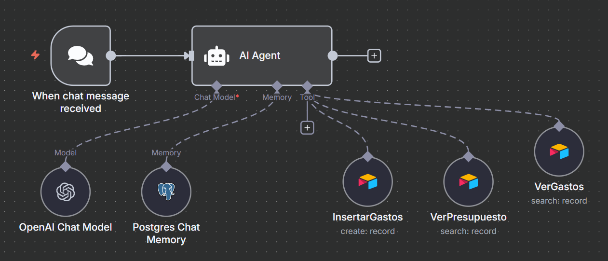

# Financial Assistant Agent

This agent helps you manage and analyze your personal finances using n8n and LangChain. It is Airtable-backed with Postgres memory, enabling fast queries, persistent chat history, and advanced automations. The agent can answer questions, calculate totals, and process receipts or invoices to track expenses and budgets by category and month.

## Features

- Responds to finance-related questions in clear (max 200 characters)
- Uses two main tools:
  - **ViewBudget**: Shows the available budget for each category per month
  - **ViewExpenses**: Shows expenses by category and month
- Extracts data from uploaded receipts/invoices and adds them to the expenses table
- Supports categories: Health, Restaurants, Transportation, Food, Sports
- All amounts are in USD
- Remembers previous interactions and can personalize responses using external memory (e.g., Postgres)
- Can be connected to messaging platforms (WhatsApp, Telegram, Slack) for conversational automation
- Designed for use with retrieval-augmented generation (RAG) and embeddings for smarter data analysis (if configured)
- Easily extendable to business tools (CRMs, ERPs, databases) for enterprise automation

## Tables

### Budget Table

| Month    | Amount (USD) | Category       |
| -------- | -----------: | -------------- |
| January  |      $100.00 | Restaurants    |
| January  |      $250.00 | Sports         |
| January  |      $400.00 | Health         |
| January  |       $55.00 | Transportation |
| January  |      $280.00 | Food           |
| February |      $266.50 | Restaurants    |
| February |      $283.00 | Sports         |
| February |      $299.50 | Health         |
| February |      $316.00 | Transportation |
| February |      $332.50 | Food           |
| December |      $866.03 | Food           |

### Expenses Table

| Name         | Amount (USD) | Date       | Category       |
| ------------ | -----------: | ---------- | -------------- |
| Restaurant A |       $45.00 | 05/01/2025 | Restaurants    |
| Gym Fee      |      $120.00 | 07/01/2025 | Sports         |
| Doctor Visit |      $200.00 | 10/01/2025 | Health         |
| Bus Ticket   |       $15.00 | 12/01/2025 | Transportation |
| Grocery      |       $80.00 | 15/01/2025 | Food           |
| Restaurant B |       $60.00 | 20/02/2025 | Restaurants    |
| Tennis Club  |      $150.00 | 22/02/2025 | Sports         |
| Pharmacy     |       $90.00 | 25/02/2025 | Health         |
| Taxi         |       $30.00 | 27/02/2025 | Transportation |
| Supermarket  |      $120.00 | 28/02/2025 | Food           |

## Usage

- Send a chat message to the agent to get information about your finances
- Upload a receipt or invoice to automatically extract and record expense details
- Ask for budget or expense summaries by category or month
- Integrate with external platforms for automated workflows

## Categories

- Restaurants
- Sports
- Health
- Transportation
- Food

## Notes

- All dates use DD/MM/YYYY format
- The difference between budget and expenses for a category is the money still available for that month
- All calculations and responses refer to USD
- No programming required: designed for nocode users and business teams

## Example Questions

- "How much did I spend on Food in March?"
- "What is my budget for Health in July?"
- "Add this receipt for Transportation from August."
- "Show me all expenses for Sports in September."
- "Connect my agent to Slack for notifications."

---

For more details, see the workflow in `FinancialAssistant.json`.
