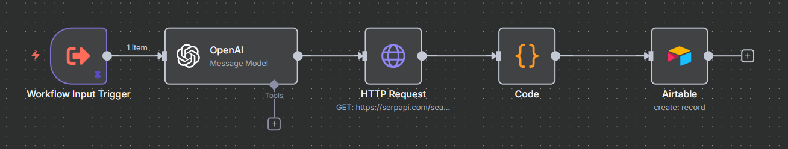
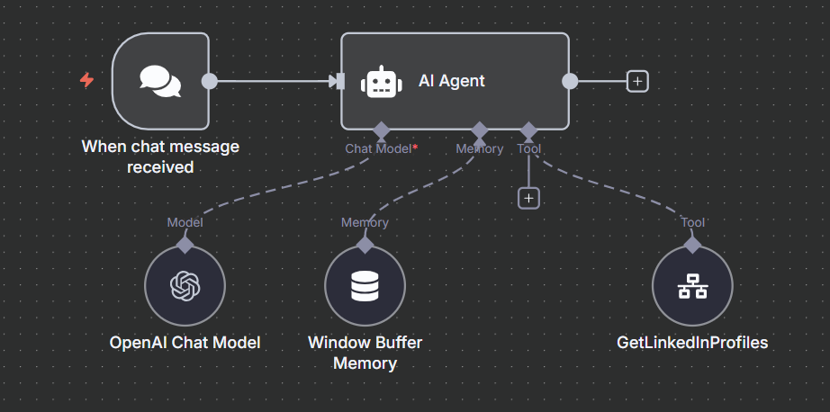

# LinkedIn Agent

## Overview

The LinkedIn Agent automates the extraction and enrichment of LinkedIn profile data using n8n, LangChain, OpenAI, and Airtable. It is designed for non-technical users to search, parse, and store LinkedIn profiles without coding.

## Features

- Responds to user queries for LinkedIn profiles based on position, sector, and location.
- Uses OpenAI to parse and enrich search parameters.
- Queries SerpAPI for LinkedIn profile search results.
- Processes and stores results in Airtable for easy access.

## Workflow Structure

### Main Agent (`LinkedIn_Agent.json`)

- **Chat Trigger:** Listens for incoming chat messages.
- **AI Agent:** Processes queries and triggers profile extraction.
- **OpenAI Chat Model:** Parses and enriches user queries.
- **Memory Buffer:** Maintains short-term chat context.
- **GetLinkedInProfiles Tool:** Calls the extract workflow for profile search and storage.

### Profile Extraction (`LinkedIn_Agent_Extract.json`)

- **Workflow Input Trigger:** Receives search parameters.
- **OpenAI:** Parses and structures the query.
- **HTTP Request:** Searches LinkedIn profiles via SerpAPI.
- **Code Node:** Processes and formats profile results.
- **Airtable:** Stores extracted profiles for later use.

## How It Works

1. User submits a query (position, sector, location) via chat.
2. The agent parses the query and triggers the extraction workflow.
3. SerpAPI searches LinkedIn profiles matching the criteria.
4. Results are parsed and stored in Airtable for further use.

## Setup Instructions

1. **Connect OpenAI:** Add your OpenAI credentials to n8n.
2. **Configure SerpAPI:** Set your SerpAPI API key for LinkedIn search.
3. **Connect Airtable:** Add Airtable credentials for profile storage.
4. **Deploy Agent:** Activate workflows in n8n.

## Environment Variables

- `LINKEDIN_OPENAI_CREDENTIAL_ID` / `LINKEDIN_OPENAI_CREDENTIAL_NAME`: OpenAI credentials for n8n.
- `SERPAPI_API_KEY`: SerpAPI key for LinkedIn search.
- Airtable credentials as configured in n8n.

## Notes

- Timezone: America/Argentina/Buenos_Aires
- No secrets are stored in workflow files; all credentials are referenced via environment variables.
- All workflows are inactive by default for safety.
- Images are referenced as covers for clarity and consistency.

## Example Query

> "Find LinkedIn profiles for marketing managers in Buenos Aires."
>
> Agent: "Found 5 LinkedIn profiles for marketing managers in Buenos Aires. Data stored in Airtable."

---

For questions or support, refer to the course documentation or open an issue in the repository.
