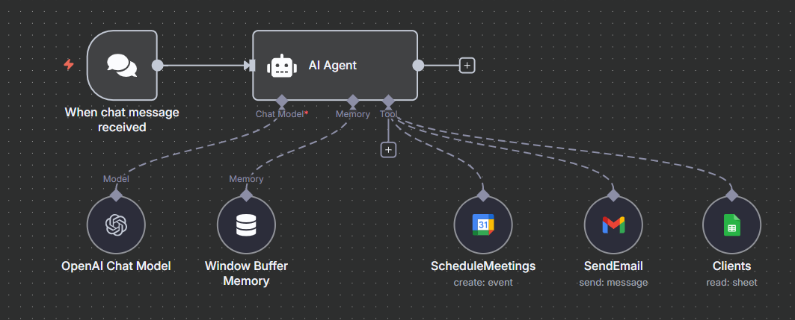

# Personal Assistant Agent

## Overview

The Personal Assistant Agent is designed to help users manage their clients, schedule meetings, and send emails automatically. Built with n8n, LangChain, OpenAI, and Google integrations, it enables non-technical users to automate client management tasks without coding.

## Features

- Responds to user queries about clients and meetings.
- Retrieves client details from a Google Sheets dataset.
- Schedules meetings using Google Calendar.
- Sends emails to clients via Gmail.
- Maintains short-term chat context for seamless conversations.

## Workflow Structure

### Main Agent (`Assistant_Agent.json`)

- **Chat Trigger:** Listens for incoming chat messages.
- **AI Agent:** Processes queries and coordinates tools.
- **Clients Tool:** Connects to Google Sheets for live client data.
- **ScheduleMeetings Tool:** Schedules events and meetings.
- **SendEmail Tool:** Sends emails to clients.
- **Memory Buffer:** Maintains chat context.

## Example Client Dataset (Google Sheets)

| Name            | Email                     | Address                    |
| --------------- | ------------------------- | -------------------------- |
| John Perez      | john.perez@email.com      | 12 Main Street, London     |
| Mary Gonzalez   | mary.gonzalez@email.com   | 45 Liberty Ave, Manchester |
| Louis Fernandez | louis.fernandez@email.com | 78 Prado Road, Liverpool   |
| Anna Martinez   | anna.martinez@email.com   | 33 Serrano St, Birmingham  |
| Peter Lopez     | peter.lopez@email.com     | 5 Spain Square, Bristol    |

## How It Works

1. User sends a message or request.
2. Agent determines if the query is about clients, meetings, or emails.
3. Retrieves client data from Google Sheets as needed.
4. Schedules meetings or sends emails using Google Calendar and Gmail.
5. Responds concisely and professionally.

## Setup Instructions

1. **Connect Google Sheets:** Add your client dataset.
2. **Configure Google Calendar:** Set up for meeting scheduling.
3. **Connect Gmail:** Add credentials for email sending.
4. **Deploy Agent:** Activate workflows in n8n.

## Environment Variables

- `PERSONAL_ASSISTANT_OPENAI_CREDENTIAL_ID` / `PERSONAL_ASSISTANT_OPENAI_CREDENTIAL_NAME`: OpenAI credentials for n8n.
- `PERSONAL_ASSISTANT_SHEETS_CREDENTIAL_ID` / `PERSONAL_ASSISTANT_SHEETS_CREDENTIAL_NAME`: Google Sheets credentials.
- `PERSONAL_ASSISTANT_GMAIL_CREDENTIAL_ID` / `PERSONAL_ASSISTANT_GMAIL_CREDENTIAL_NAME`: Gmail credentials.
- `PERSONAL_ASSISTANT_CALENDAR_CREDENTIAL_ID` / `PERSONAL_ASSISTANT_CALENDAR_CREDENTIAL_NAME`: Google Calendar credentials.
- `PERSONAL_ASSISTANT_SENDER_NAME`: Sender name for emails.
- `PERSONAL_ASSISTANT_CALENDAR_EMAIL`: Calendar email for scheduling.

## Notes

- Timezone: America/Argentina/Buenos_Aires
- No secrets are stored in workflow files; all credentials are referenced via environment variables.
- All workflows are inactive by default for safety.
- Images are referenced as covers for clarity and consistency.

## Example Query

> "Schedule a meeting with John Perez next Monday at 10am."

> Agent: "Meeting scheduled with John Perez for next Monday at 10am. Invitation sent to john.perez@email.com."

---

For questions or support, refer to the course documentation or open an issue in the repository.
