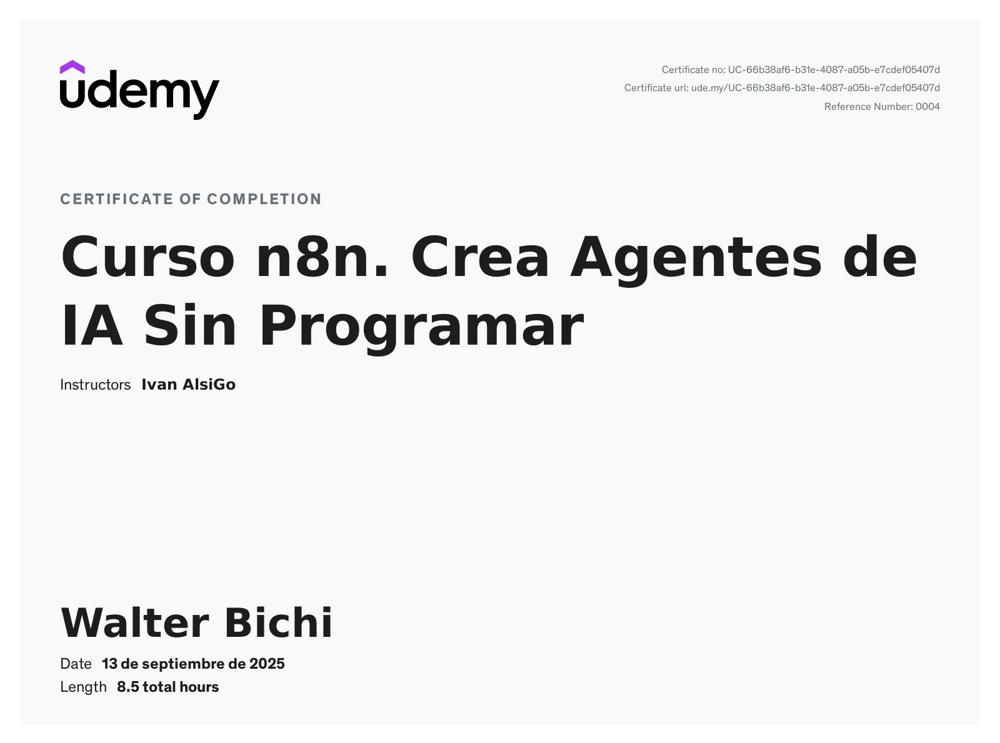

# Modular AI Agents with n8n & LangChain

## Overview

This repository is a showcase of modular AI agents built with n8n, LangChain, and vector databases (Pinecone). Developed as part of a practical course, it demonstrates how non-technical users can create, automate, and deploy advanced AI workflows without writing code.

## What You Learn

- Building AI agents in n8n using visual workflows
- Integrating OpenAI, Pinecone, Airtable, Google Sheets, SerpAPI, and more
- Using embeddings, RAG (Retrieval-Augmented Generation), and memory buffers
- Automating business processes: customer support, event management, personal assistance, LinkedIn profile extraction, and e-commerce operations
- Designing, optimizing, and deploying agents for real-world use cases

## Skills Developed

- Workflow design and automation
- Data integration and enrichment
- Advanced prompt engineering
- Semantic search and document retrieval
- Secure credential and environment variable management
- Professional documentation and dataset handling

## Target Audience

- Non-technical users
- Students and professionals seeking automation
- Business owners and teams wanting practical AI solutions

## Repository Structure

Each agent folder contains:

- One or more n8n workflow files (.json)
- README.md (full documentation)
- Workflow preview images (cover.png or agent-specific)
- Additional resources (docx, markdown, etc.)

## Agents Included

- **Financial Assistant Agent**: Automates personal finance management, budget tracking, and expense analysis.
- **Coworking Agent**: Manages coworking space events, member reservations, and document search.
- **Ecommerce Agent**: Answers customer queries, provides product info, and supports e-commerce operations.
- **LinkedIn Agent**: Extracts and enriches LinkedIn profile data for business intelligence.
- **Personal Assistant Agent**: Automates client management, meeting scheduling, and email communication.

## Example Datasets

All agents use example datasets. The first 5 rows of each are embedded in their respective README.md files for clarity.

## Setup Requirements

- n8n (self-hosted or cloud)
- OpenAI API
- Pinecone
- Airtable
- Google Sheets & Drive
- SerpAPI (for LinkedIn Agent)
- All environment variables and credentials are documented in each agent's README.md

## Notes

- All workflows are inactive by default for safety
- No secrets are stored in workflow files; credentials are referenced via environment variables
- Timezone: America/Argentina/Buenos_Aires
- All agent workflow images are now centralized under `/images` for consistency. Each agent README references its images from this folder.

## How to Use

1. Review each agent folder and its README.md for setup and usage instructions
2. Connect required services and configure environment variables
3. Activate workflows in n8n and start automating your business processes

## Course Outcomes

By completing this project, you will:

- Gain hands-on experience with modular AI agent design
- Learn to automate and optimize real-world tasks
- Empower yourself and your team with practical, no-code AI solutions

---

For questions, support, or feedback, refer to the course documentation or open an issue in this repository.
